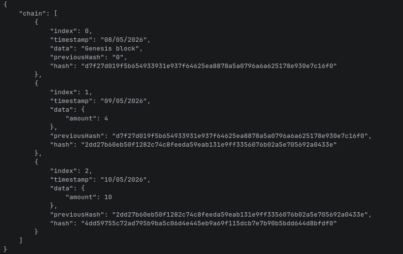
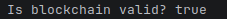
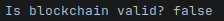

# 🧱 Blockchain — Dev Diary

A lightweight personal blockchain built in Node.js using `crypto-js`.  
This project documents my learning progress while building a basic blockchain from scratch, including classes, hashing logic, and debugging issues.

---

<details>
<summary><strong>📅 08/05/2026 — Day 1: Core Blockchain Structure + Hashing</strong></summary>

## 🧠 What I Built Today

### 🔹 `Block` Class
Represents a single block in the chain.

**Purpose:**
- Stores transaction data
- Links to the previous block via `previousHash`
- Generates its own cryptographic hash

**Key function:**
- `calculateHash()` → creates a SHA256 hash of block contents to ensure immutability

---

### 🔹 `Blockchain` Class
Manages the full chain of blocks.

**Purpose:**
- Initializes the chain with a genesis block
- Adds new blocks securely
- Ensures each block is linked via hashes

**Key functions:**
- `createGenesisBlock()` → creates the first block in the chain
- `getLatestBlock()` → retrieves the most recent block
- `addBlock()` → assigns `previousHash`, recalculates hash, and appends the block

---

### 🔐 Hashing
Used `crypto-js`:

```js
import CryptoJS from 'crypto-js';
```



---

</details>


<details>
<summary><strong>📅 09/05/2026 — Day 2: Blockchain Validation & Tamper Detection</strong></summary>

## 🧠 What I Built Today

### 🔹 `isChainValid()` Function
Added blockchain validation logic to verify the integrity of the chain.

**Purpose:**
- Detect tampering inside blocks
- Ensure hashes are still valid
- Confirm blocks are correctly linked together

---

## ⚙️ How Validation Works

The function loops through the blockchain starting from block `1` (skipping the genesis block).

For each block it checks:

### ✅ 1. Has the block data been modified?
```js
if(currentBlock.hash !== currentBlock.calculateHash())
```

This recalculates the hash using the current block data.

If the recalculated hash differs from the stored hash:
- the block has been changed
- the blockchain is invalid

---

### ✅ 2. Is the chain still linked correctly?
```js
if(currentBlock.previousHash !== previousBlock.hash)
```

This ensures every block still points to the correct previous block.

If the hashes no longer match:
- the chain integrity is broken
- the blockchain is invalid

---

## 🧪 Test 1 — Valid Blockchain

### Action
Created a blockchain and added two valid blocks.

```js
let BubbaCoin = new Blockchain();
BubbaCoin.addBlock(new Block(1, "09/05/2026", { amount: 4 }));
BubbaCoin.addBlock(new Block(2, "10/05/2026", { amount: 10 }));
```

Then checked validity:

```js
console.log('Is blockchain valid? ' + BubbaCoin.isChainValid());
```

### ✅ Result
Output:



---

## 🧪 Test 2 — Attempted Tampering

### Action
Modified block data manually to simulate an attack:

```js
BubbaCoin.chain[1].data = { amount: 100 };
BubbaCoin.chain[1].hash = BubbaCoin.chain[1].calculateHash();
```

This changed the transaction amount from:
- `4` → `100`

Then validated the chain again.

---

### ❌ Result
Output:



---

## 🚀 Result

The blockchain can now:
- validate chain integrity
- detect altered transaction data
- detect broken block links
- simulate tamper protection used in real blockchains

</details>
