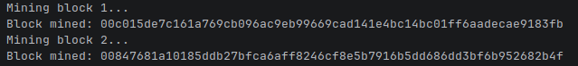
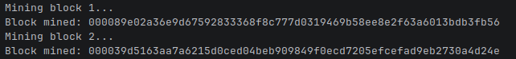

# 🧱 Blockchain — Dev Diary

A lightweight personal 
blockchain built in Node.js using `crypto-js`.  
This project documents my learning progress while building a basic blockchain from scratch, including classes, hashing logic, and debugging issues.

---

<details>
<summary><strong>📅 08/05/2026 — Day 1: Core Blockchain Structure + Hashing</strong></summary>

## 🧠 What I Built Today

### 🔹 `Block` Class
Represents a single block in the chain.

**Purpose:**
- Stores transaction data
- Links to the previous block via `previousHash`
- Generates its own cryptographic hash

**Key function:**
- `calculateHash()` → creates a SHA256 hash of block contents to ensure immutability

---

### 🔹 `Blockchain` Class
Manages the full chain of blocks.

**Purpose:**
- Initializes the chain with a genesis block
- Adds new blocks securely
- Ensures each block is linked via hashes

**Key functions:**
- `createGenesisBlock()` → creates the first block in the chain
- `getLatestBlock()` → retrieves the most recent block
- `addBlock()` → assigns `previousHash`, recalculates hash, and appends the block

---

### 🔐 Hashing
Used `crypto-js`:

```js
import CryptoJS from 'crypto-js';
```


---

</details>


<details>
<summary><strong>📅 09/05/2026 — Day 2: Blockchain Validation & Tamper Detection</strong></summary>

## 🧠 What I Built Today

### 🔹 `isChainValid()` Function
Added blockchain validation logic to verify the integrity of the chain.

**Purpose:**
- Detect tampering inside blocks
- Ensure hashes are still valid
- Confirm blocks are correctly linked together

---

## ⚙️ How Validation Works

The function loops through the blockchain starting from block `1` (skipping the genesis block).

For each block it checks:

### ✅ 1. Has the block data been modified?
```js
if(currentBlock.hash !== currentBlock.calculateHash())
```

This recalculates the hash using the current block data.

If the recalculated hash differs from the stored hash:
- the block has been changed
- the blockchain is invalid

---

### ✅ 2. Is the chain still linked correctly?
```js
if(currentBlock.previousHash !== previousBlock.hash)
```

This ensures every block still points to the correct previous block.

If the hashes no longer match:
- the chain integrity is broken
- the blockchain is invalid

---

## 🧪 Test 1 — Valid Blockchain

### Action
Created a blockchain and added two valid blocks.

```js
let BubbaCoin = new Blockchain();
BubbaCoin.addBlock(new Block(1, "09/05/2026", { amount: 4 }));
BubbaCoin.addBlock(new Block(2, "10/05/2026", { amount: 10 }));
```

Then checked validity:

```js
console.log('Is blockchain valid? ' + BubbaCoin.isChainValid());
```

### ✅ Result
Output:


---

## 🧪 Test 2 — Attempted Tampering

### Action
Modified block data manually to simulate an attack:

```js
BubbaCoin.chain[1].data = { amount: 100 };
BubbaCoin.chain[1].hash = BubbaCoin.chain[1].calculateHash();
```

This changed the transaction amount from:
- `4` → `100`

Then validated the chain again.

---

### ❌ Result
Output:


---

## 🚀 Result

The blockchain can now:
- validate chain integrity
- detect altered transaction data
- detect broken block links
- simulate tamper protection used in real blockchains

</details>

<details>
<summary><strong>📅 10/05/2026 — Day 3: Proof of Work + Transactions</strong></summary>

## 🧠 What I Built Today

### 🔹 Proof of Work
Introduced a mining system using a `nonce` value and hash difficulty rules.

**Purpose:**
- Forces blocks to be mined before being added
- Makes hash generation computationally expensive
- Simulates real blockchain mining behaviour

**Key additions:**
- Added `nonce` to the `Block` class
- Created `mineBlock(difficulty)` function
- Implemented mining loop until hash starts with required zeros

---

### ⛏️ Mining Difficulty
Started with a difficulty of `2` and later increased it to `4`.

Added console logs to track the mining process and observe how increasing difficulty affects mining time.

```js
console.log('Mining block 1...'); 
BubbaCoin.addBlock(new Block(1, "09/05/2026", { amount: 4 }));

console.log('Mining block 2...'); 
BubbaCoin.addBlock(new Block(2, "10/05/2026", { amount: 10 })); 
```

### 🔍 Understanding the Output

When the mining difficulty was set to `2`, valid hashes had to begin with 2 zeros (00).

---

When the mining difficulty was set to `4`, valid hashes had to begin with 4 zeros (0000).

---

> This demonstrates how higher difficulty increases the amount of work needed to mine a valid block.

---

### 🔹 `Transaction` Class
Introduced a dedicated `Transaction` class to represent transfers between wallet addresses.

**Purpose:**
- Stores sender address, receiver address, and amount
- Separates transaction logic from block structure
- Makes the blockchain easier to scale later

---

### 🔹 Pending Transactions
Added a `pendingTransactions` array to temporarily store transactions before they are mined into a block.

**Purpose:**
- Mimics how real blockchains queue transactions
- Allows multiple transactions to be grouped into a single mined block

---

### ⛏️ Miner Rewards
Implemented a mining reward system using:

```js
this.miningReward = 100;
```
After a block is mined, the miner receives a reward transaction:
```js
new Transaction(null, miningRewardAddress, this.miningReward)
```

**Purpose:**
- Simulates how blockchain miners are incentivized
- null as the sender represents newly generated coins

---

### 🔹 `minePendingTransactions()`

Created a function to:
- Take all pending transactions
- Place them into a new block
- Mine the block using proof of work
- Reward the miner after successful mining

---

### 🔹 `createTransaction()`

Added a helper function for pushing new transactions into `pendingTransactions`.

**Purpose:**
- Keeps transaction creation organized
- Simplifies adding future validation logic

---

### 💰 `getBalanceOfAddress()`

Implemented balance calculation logic by scanning every transaction in the blockchain.

**Purpose:**
- Calculates a wallet’s balance without storing a separate balance variable
- Uses transaction history as the single source of truth
- Mimics how real cryptocurrencies track balances

---


</details>

<details>
<summary><strong>📅 15/05/2026 — Day 4: Digital Signatures + Wallet Security</strong> </summary>

## 🧠 What I Built Today

### 🔹 Project Refactor
Split the original `main.js` into separate files for better structure and readability.

**New files:**
- `blockchain.js` → blockchain logic and classes
- `keygenerator.js` → generates wallet key pairs
- `main.js` → runs transactions and mining tests

---

### 🔐 Digital Signatures
Introduced transaction signing using the `elliptic` package and the `secp256k1` curve (used by Bitcoin).

```js
import elliptic from 'elliptic';
```

**Purpose:**
- Proves transaction ownership
- Prevents users from sending coins they do not own
- Adds real wallet-style security to the blockchain

---

### 🔑 Wallet Key Generation

Created a separate `keygenerator.js` file to generate:
- A private key
- A public key

```js
const key = ec.genKeyPair();
```
Generates:
- **Private key** is used to sign transactions
- **Public key** acts as the wallet address

---

### ⚠️ Using the Generated Keys

To create valid transactions:
1. Run `keygenerator.js`
2. Copy the generated private key
3. Paste the private key into `main.js`

```js
const myKey = ec.keyFromPrivate('');
```

### 🔹 `signTransaction()` method in `Transaction` class.
**Purpose:**
- Cryptographically signs a transaction
- Confirms the sender owns the wallet
- Prevents fake transactions

---

### 🔍 `isValid()` method in `Transaction` class.
**Purpose:**
- Verifies that a transaction contains a valid digital signature
- Confirms the signature matches the sender’s public key
- Detects whether transaction data has been tampered with

This ensures only legitimate signed transactions can be added to the blockchain.

---

### 🔹 `hasValidTransactions()` method inside `Block` class.

**Purpose:**
- Loops through every transaction stored in a block
- Checks whether each transaction is valid
- Rejects blocks containing invalid or tampered transactions

---

### 🛡️ `isChainValid()`

Updated the `isChainValid()` method inside the `Blockchain` class.

The blockchain now verifies:
- Hash integrity
- Previous hash links
- Transaction authenticity

This makes the blockchain significantly more secure than previous versions by validating both the chain structure and transaction legitimacy.

</details>
